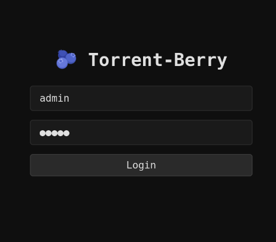

# 🫐 Torrent-berry

A light BitTorrent client designed for lowend Linux devices like  Raspberry Pis, I wanted to make something like qbittorrent since im trying to make apps to run on my pi cluster


 

## Features

-Basic torrenting stuff like magnet links and torrent files

-Web ui accessible from any device over your network or host device if it has a browser

-sytem stats panel

-Download crash recovery

-made specifically for low end devices


## Requirements

- any linux distro: (ARM or x86)
- Python 3.11+
- 512MB RAM minimum (not reccomended as i havent tested that), 1GB+ recommended

## Install

```bash
git clone https://github.com/Melangert/Torrent-Berry
cd Torrent-Berry
chmod +x install.sh
sed -i 's/\r$//' install.sh
./install.sh
```

Then open `http://your-ip:8080` in your browser or just click the link provided when it starts.

## Configuration

All config is done with environment variables:

| Variable | Default | Description |
|---|---|---|
| TORBERRY_BASE_DIR | ~/torberry | Base directory for data |
| TORBERRY_HOST | 0.0.0.0 | API host |
| TORBERRY_PORT | 8080 | API port |
| TORBERRY_SECRET_KEY | changeme | JWT signing key — **should be changed** |
| TORBERRY_USERNAME | admin | default Login username |
| TORBERRY_PASSWORD | admin |  default Login password |
| TORBERRY_DL_LIMIT | 0 | Download limit in bytes/s (0 = unlimited) |
| TORBERRY_UL_LIMIT | 0 | Upload limit in bytes/s (0 = unlimited) |
| TORBERRY_MAX_CONNECTIONS | 50 | Max peer connections |
| TORBERRY_LISTEN_PORT | 6881 | BitTorrent listen port |


## File locations


Downloaded files go to `~/torberry/downloads` defaultly.  you can change this with the `TORBERRY_BASE_DIR` env var.


## License

MIT

code not read me made with help from claude
